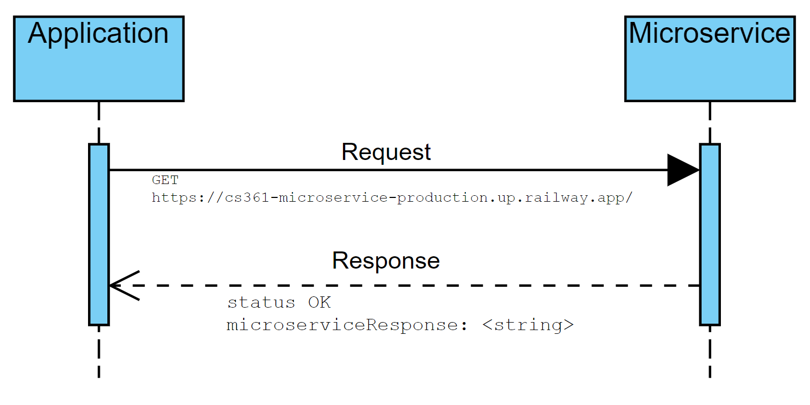

## Hex Triplet Generator
Microservice that recieves a request, generates a random hexadecimal triplet, and returns it as a string.

### Requesting Data
Request data from the microservice using a `GET` request to this endpoint: `https://cs361-microservice-production.up.railway.app/`.
```javascript
fetch('https://cs361-microservice-production.up.railway.app/')
```

### Recieving Data
Data is sent back as a string in text format. Use `response.text()` to access the data.
```javascript
fetch('https://cs361-microservice-production.up.railway.app/')
  .then((response) => response.text())
  .then((data) => console.log(data));
```

### Example Data
`#cd2055`
`#ad23a0`
`#084ff8`

### UML Diagram
